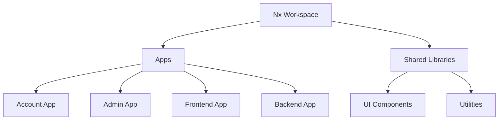

# Pixels Shop Monorepo Documentation

## Overview

Pixels Shop uses an Nx monorepo structure to manage multiple applications and shared libraries efficiently. The monorepo ensures consistent dependency management, code reuse, and modular development for a multi-tenant e-commerce platform.

---

## Monorepo Structure

```
apps/
  account/        # User registration, login, and account flows
  admin/          # Admin dashboard for store and product management
  frontend/       # Main e-commerce frontend application
  backend/        # API server (REST & GraphQL)
libs/             # Shared libraries
  ui/             # Reusable UI components
  utils/          # Utility functions (helpers, formatters, etc.)
package.json      # Root dependencies and scripts
nx.json           # Nx workspace configuration
```

### Nx Monorepo Diagram



---

## Apps Breakdown

### 1. Account App

* Handles user registration, login, password reset, and account management.
* Key files: `Create.jsx`, `SignIn.jsx`.
* API integration with `/api/v1/user/*` endpoints.
* Flow ensures secure token storage in `localStorage`.

### 2. Admin App

* Manages products, users, orders, and store settings.
* Key files: `about/page.jsx`, `products/page.jsx`, `users/page.jsx`, `settings/page.jsx`.
* Uses reusable UI components and centralized API calls.
* Supports role-based access control for admins.

### 3. Frontend App

* Customer-facing e-commerce UI.
* Core components: `Header`, `Navbar`, `Footer`, `HeroSection`, `ProductSection`, `CartIcon`.
* Pages: Homepage, ProductDetails, CategoryPage, Cart, Account, AboutUs, ContactUs, FAQ, Policies.
* Integrates GraphQL and REST APIs for product data, cart, orders, and content.

### 4. Backend App

* Node.js + Express server.
* Handles REST for CRUD operations and GraphQL for complex nested queries.
* Middleware includes JWT authentication, role-based authorization, rate limiting, and file uploads.
* Two databases: MongoDB (main) and PostgreSQL (account/store data).

---

## Shared Libraries

### 1. UI Library (`libs/ui`)

* Reusable React components.
* Standardized styling with Tailwind CSS.
* Includes `Button`, `Input`, `Modal`, `Card`, etc.

### 2. Utilities (`libs/utils`)

* Helper functions and shared logic.
* Examples: `formatCurrency`, `validateEmail`, `imageUrlBuilder`, API clients.

### Shared Library Diagram

```mermaid
graph TD
  Shared Libraries --> UI Components
  Shared Libraries --> Utils
  Account App --> UI Components
  Admin App --> UI Components
  Frontend App --> UI Components
  Backend App --> Utils
```

---

## Nx Workflow Commands

* **Generate a library:**

```bash
npx nx g @nx/js:lib packages/pkg1 --publishable --importPath=@my-org/pkg1
```

* **Build a project:**

```bash
npx nx build <project-name>
```

* **Run any task:**

```bash
npx nx <target> <project-name>
```

* **Sync TypeScript project references:**

```bash
npx nx sync
```

* **Check references in CI:**

```bash
npx nx sync:check
```

---

## Monorepo Advantages

1. **Code Reuse:** Shared UI and utility libraries reduce duplication.
2. **Consistency:** Single source of truth for dependencies and configuration.
3. **Modular Development:** Separate apps for account, admin, frontend, and backend.
4. **Scalability:** Easy to add new apps or libraries without impacting others.
5. **Efficient CI/CD:** Nx provides caching and task optimization for faster builds.

---

## Monorepo Diagram with Data Flow

```mermaid
flowchart TD
  User -->|Register/Login| Account App
  Account App -->|JWT Token| Backend API
  User -->|Browse Products| Frontend App
  Frontend App -->|Fetch Data| Backend API
  Admin App -->|Manage Products/Orders| Backend API
  Backend API --> MongoDB
  Backend API --> PostgreSQL
  Backend API --> External Services
```

This diagram shows how the monorepo applications interact with each other and the databases, providing a clear view of data flow in the Pixels Shop multi-tenant platform.
