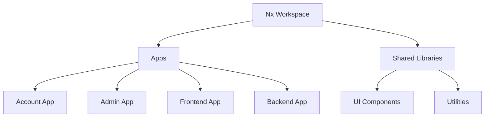
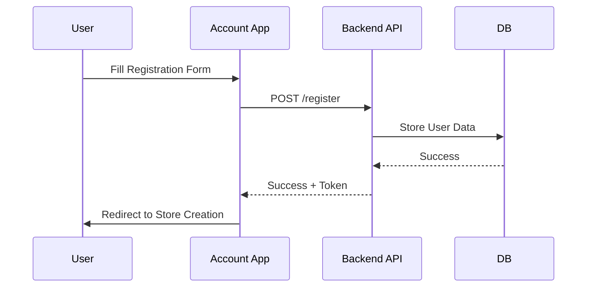
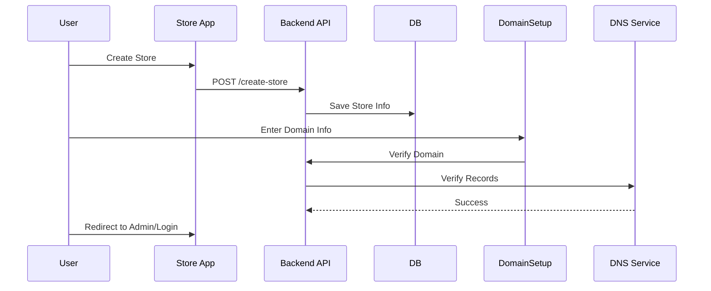
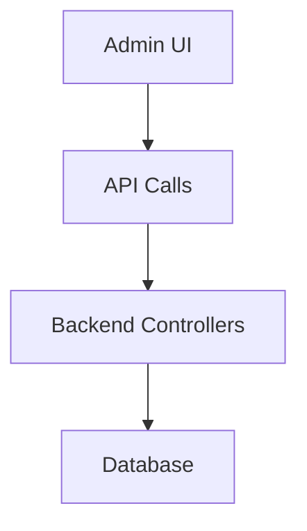
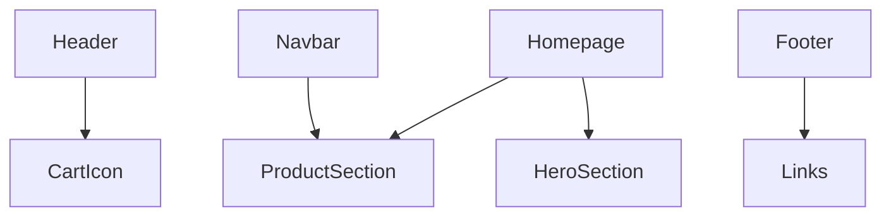
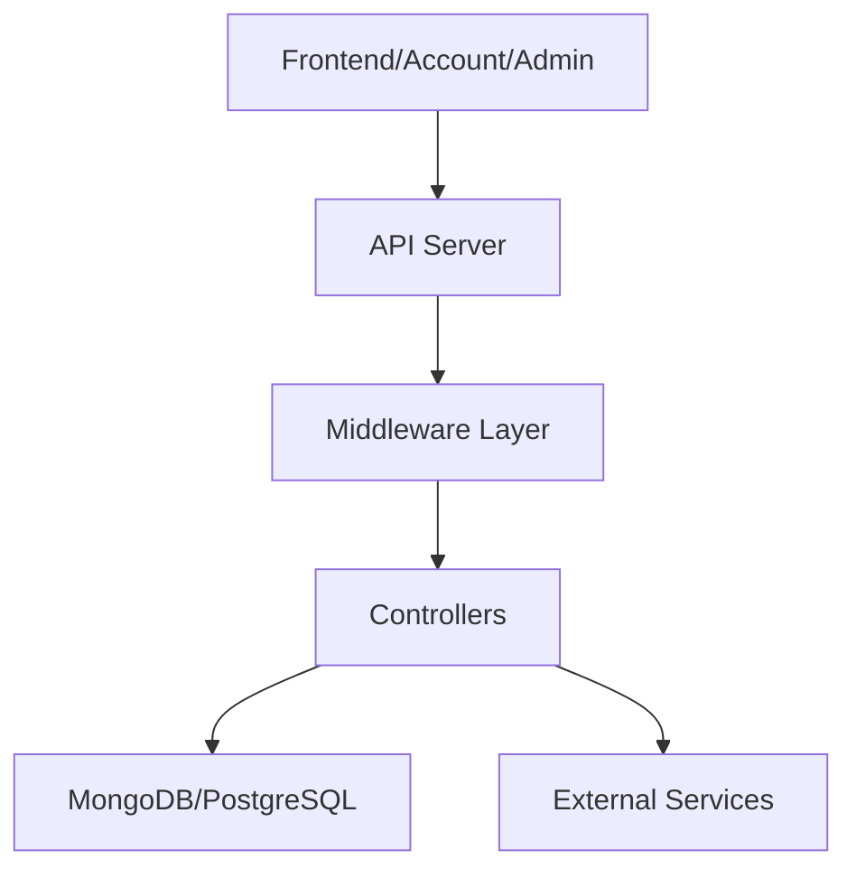
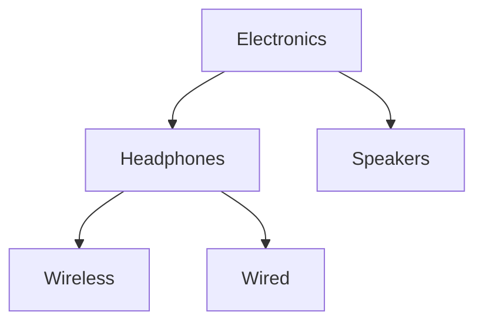
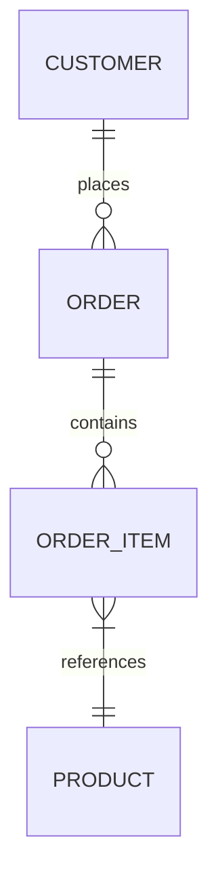
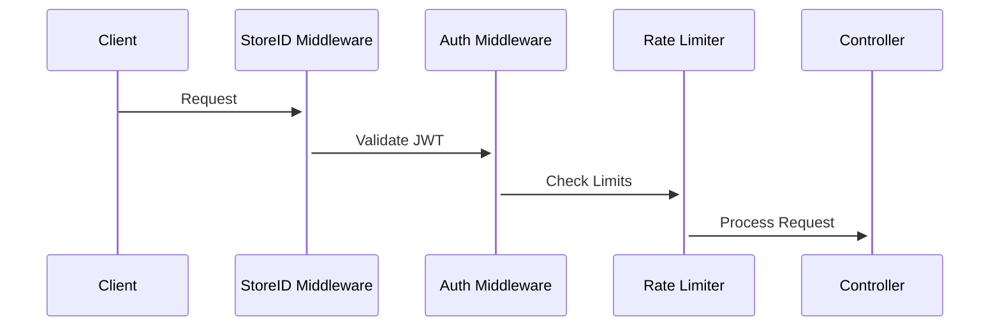

# Pixels Shop Full Documentation

## Overview

Pixels Shop is a multi-tenant e-commerce platform that enables merchants to create online stores, manage products, and sell to customers. This document provides a comprehensive guide covering account creation, store setup, admin dashboard, frontend application, backend architecture, databases, APIs, Nx monorepo, deployment, and scaling.

---

## Table of Contents

1. [Monorepo Structure](#monorepo-structure)
2. [Account Management](#account-management)
3. [Store Setup & Domain Management](#store-setup--domain-management)
4. [Admin Dashboard](#admin-dashboard)
5. [Frontend Application](#frontend-application)
6. [Backend Architecture](#backend-architecture)
7. [Database Models](#database-models)
8. [Middleware & Security](#middleware--security)
9. [API Endpoints](#api-endpoints)
10. [GraphQL & REST Integration](#graphql--rest-integration)
11. [State Management](#state-management)
12. [Routing & Navigation](#routing--navigation)
13. [Styling & UI](#styling--ui)
14. [Deployment & Scaling](#deployment--scaling)

---

## Monorepo Structure

Nx workspace is used to manage multiple applications (account, admin, frontend, backend) and shared libraries.

```
apps/
  account/        # Account creation & user flows
  admin/          # Admin dashboard
  frontend/       # Main e-commerce frontend
  backend/        # API server
libs/             # Shared libraries
  ui/             # Reusable components
  utils/          # Utility functions
package.json
nx.json
```

### Nx Diagram



---

## Account Management

### User Registration (`Create.jsx`)

* Fields: Name, Email, Phone, Address, Password
* Validation: Password match, min length, phone validation
* API: `POST /api/v1/user/register`

### Login (`SignIn.jsx`)

* Fields: Email, Password
* API: `POST /api/v1/user/login`
* Stores token & user data in `localStorage`

### Account Flow Diagram



---

## Store Setup & Domain Management

### Store Creation (`Create-Store.jsx`)

* Fields: Store name, Business type, Brand color, Logo
* API: `POST /api/v1/user/create-store`

### Domain Setup (`DomainSetup.jsx` & `DomainVerify.jsx`)

* DNS A record and CNAME configuration
* Domain verification and redirection

### Store Setup Diagram



---

## Admin Dashboard

### Features

* About page management
* Product management
* User management
* Store settings configuration
* API integration for CRUD operations

### Folder Structure

```
apps/admin/
  app/
    about/page.jsx
    products/page.jsx
    users/page.jsx
    settings/page.jsx
    components/Sidebar.jsx
    components/Navbar.jsx
    api/index.js
    styles/
```

### Admin Workflow Diagram



---

## Frontend Application

* Core components: Header, Navbar, Footer, HeroSection, ProductSection, CartIcon
* Pages: Homepage, ProductDetails, Category, Cart, Account, AboutUs, ContactUs, FAQ, Policies
* State management via React Context and hooks
* GraphQL & REST integration

### Component Interaction Diagram



---

## Backend Architecture

* Node.js with Express
* Hybrid API: REST for CRUD, GraphQL for nested queries
* Two databases: MongoDB (main), PostgreSQL (account/store data)
* Middleware: Authentication, Authorization, Rate Limiting, File Uploads

### Backend Diagram



---

## Database Models

### Product Model

```javascript
{
  storeId: 'STR_123',
  sku: 'PROD-456',
  slug: 'wireless-headphones',
  specifications: [{key: 'Battery', value: '20hrs'}]
}
```

### Category Model



### Orders ERD



---

## Middleware & Security

* JWT Authentication
* Store-based authorization
* Role-based access control
* Validation & sanitization

### Middleware Flow Diagram



---

## API Endpoints

| Endpoint      | Method    | Description             |
| ------------- | --------- | ----------------------- |
| /api/products | GET, POST | List or create products |
| /api/users    | GET, POST | User CRUD operations    |
| /api/orders   | GET, POST | Manage orders           |
| /api/payments | POST      | Payment processing      |

---

## Deployment & Scaling

* Load Balancer (NGINX)
* Auto-scaling API instances
* MongoDB sharding by storeId
* Redis caching
* CDN for media

### Deployment Diagram

```mermaid
graph TD
  Cloudflare --> NGINX
  NGINX --> API1
  NGINX --> API2
  API1 --> MongoDB Cluster
  API2 --> MongoDB Cluster
  MongoDB Cluster --> Redis Cache
```

---

This comprehensive documentation provides diagrams, flowcharts, and step-by-step explanations for the Pixels Shop monorepo, ensuring clarity for developers, admins, and stakeholders.
