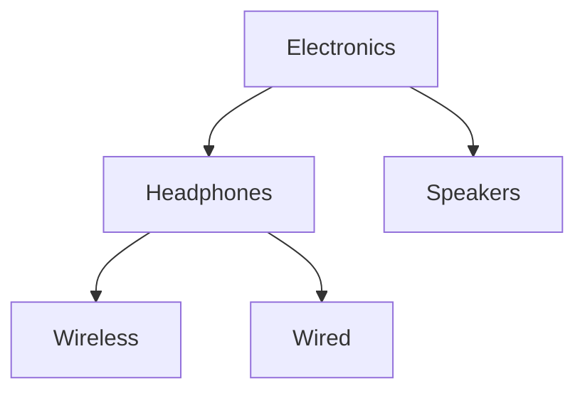
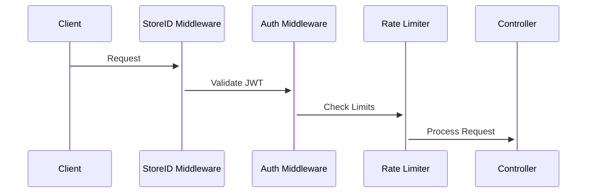

# Pixels Shope Monorepo

Welcome to the **Pixels Shope Monorepo**. This repository contains multiple projects and apps for our e-commerce platform, managed together using **Nx** and a monorepo structure.

---

## Monorepo Structure

```
pixels-shope/
├─ apps/
│  ├─ account/        # Customer-facing Vite React app
│  ├─ frontend/       # Main Vite React storefront
│  ├─ admin/          # Admin dashboard (Next.js)
│  └─ node-api/       # Node.js API (Express + GraphQL)
├─ packages/          # Shared packages/libraries
├─ nx.json            # Nx workspace configuration
├─ package.json       # Root package.json with scripts
├─ tsconfig.json      # Root TypeScript config
└─ README.md
```

---

## Installation

1. Clone the repository:

```bash
git clone https://github.com/gotesgan/pixels-shope.git
cd pixels-shope
```

2. Install dependencies:

```bash
npm install
```

3. Install dependencies for apps (if needed):

```bash
npm install --prefix apps/account
npm install --prefix apps/frontend
npm install --prefix apps/admin
npm install --prefix apps/node-api
```

---

## Available Scripts

From the root of the monorepo, you can run scripts for each app individually or all together.

### Run all apps concurrently

```bash
npm run dev:all
```

This will start:

* **Account (Vite React)**
* **Frontend (Vite React)**
* **Admin (Next.js)**
* **Node API (Express + GraphQL)**

### Run individual apps

```bash
npm run dev:account      # Customer account app
npm run dev:frontend     # Storefront frontend
npm run dev:admin        # Admin dashboard
npm run dev:node-api     # Backend API
```

---

<<<<<<< HEAD
## Frontend Application

* Core components: Header, Navbar, Footer, HeroSection, ProductSection, CartIcon
* Pages: Homepage, ProductDetails, Category, Cart, Account, AboutUs, ContactUs, FAQ, Policies
* State management via React Context and hooks
* GraphQL & REST integration

### Component Interaction Diagram

```mermaid
graph TD
  Header --> CartIcon
  Navbar --> ProductSection
  Homepage --> HeroSection
  Homepage --> ProductSection
  Footer --> Links
=======
## Nx Monorepo Features

* Centralized management for multiple apps and packages.
* Shared configurations and libraries.
* Ability to run and build apps independently or together.
* Easy dependency tracking across apps.

---

## Node API (apps/node-api)

* **Server**: Express + GraphQL
* **Database**: MongoDB (and optional Prisma for SQL)
* **Scripts**:

```bash
npm run dev    # Start API with nodemon
>>>>>>> 11b0e956e098e35fe43f2a3d8ddd7652ecf42da7
```

---

<<<<<<< HEAD
## Backend Architecture

* Node.js with Express
* Hybrid API: REST for CRUD, GraphQL for nested queries
* Two databases: MongoDB (main), PostgreSQL (account/store data)
* Middleware: Authentication, Authorization, Rate Limiting, File Uploads

### Backend Diagram

```mermaid
graph TD
  A[Frontend/Account/Admin] --> B[API Server]
  B --> C[Middleware Layer]
  C --> D[Controllers]
  D --> E[MongoDB/PostgreSQL]
  D --> F[External Services]
=======
## Admin App (apps/admin)

* **Framework**: Next.js
* **TailwindCSS** integrated
* **Scripts**:

```bash
npm run dev    # Start Next.js dev server
>>>>>>> 11b0e956e098e35fe43f2a3d8ddd7652ecf42da7
```

---

<<<<<<< HEAD
## Database Models

### Product Model

```javascript
{
  storeId: 'STR_123',
  sku: 'PROD-456',
  slug: 'wireless-headphones',
  specifications: [{key: 'Battery', value: '20hrs'}]
}
```

### Category Model



### Orders ERD

```mermaid
erDiagram
  CUSTOMER ||--o{ ORDER : places
  ORDER ||--o{ ORDER_ITEM : contains
  ORDER_ITEM }|--|| PRODUCT : references
=======
## Frontend Apps (apps/account & apps/frontend)

* **Framework**: React + Vite
* **TailwindCSS** integrated
* **Scripts**:

```bash
npm run dev    # Start Vite dev server
>>>>>>> 11b0e956e098e35fe43f2a3d8ddd7652ecf42da7
```

---

<<<<<<< HEAD
## Middleware & Security

* JWT Authentication
* Store-based authorization
* Role-based access control
* Validation & sanitization

### Middleware Flow Diagram



---

## API Endpoints

| Endpoint      | Method    | Description             |
| ------------- | --------- | ----------------------- |
| /api/products | GET, POST | List or create products |
| /api/users    | GET, POST | User CRUD operations    |
| /api/orders   | GET, POST | Manage orders           |
| /api/payments | POST      | Payment processing      |

---

## Deployment & Scaling

* Load Balancer (NGINX)
* Auto-scaling API instances
* MongoDB sharding by storeId
* Redis caching
* CDN for media

### Deployment Diagram

```mermaid
graph TD
  Cloudflare --> NGINX
  NGINX --> API1
  NGINX --> API2
  API1 --> MongoDB Cluster
  API2 --> MongoDB Cluster
  MongoDB Cluster --> Redis Cache
```

---

This comprehensive documentation provides diagrams, flowcharts, and step-by-step explanations for the Pixels Shop monorepo, ensuring clarity for developers, admins, and stakeholders.
=======
## Contributing

1. Fork the repository.
2. Create a feature branch (`git checkout -b feature/my-feature`).
3. Commit changes (`git commit -m 'Add some feature'`).
4. Push to the branch (`git push origin feature/my-feature`).
5. Create a Pull Request.

---

## License

**Pixels-Perfect License**

* Non-commercial use only.
* All code can be copied, shared, or modified for non-commercial purposes.
* Any commercial use without permission will be considered a breach of contract.

---

**Happy coding!**
>>>>>>> 11b0e956e098e35fe43f2a3d8ddd7652ecf42da7
