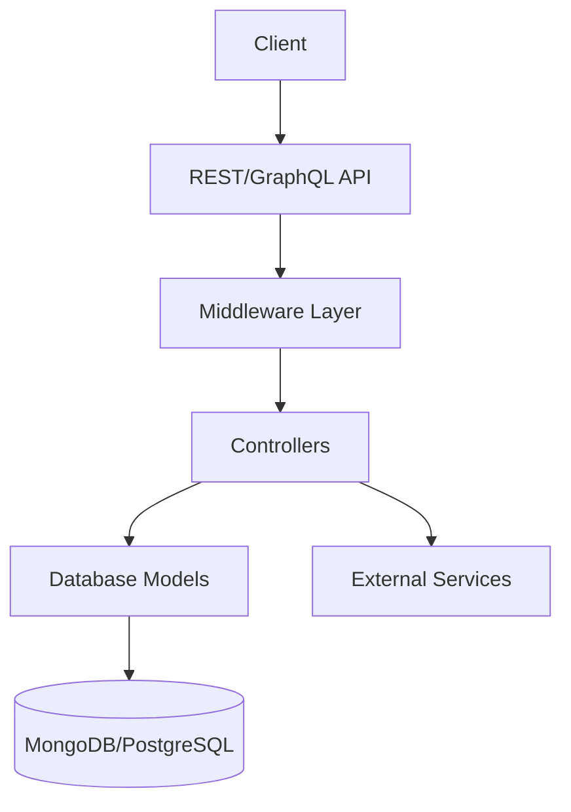
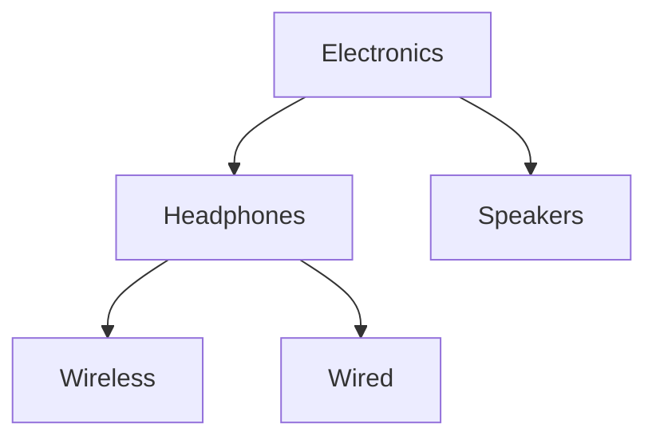
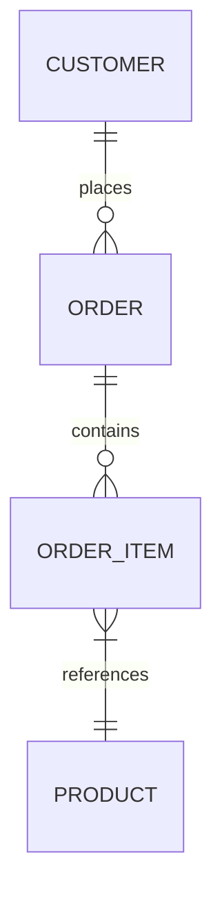
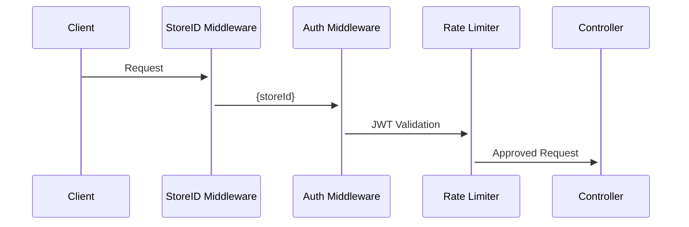
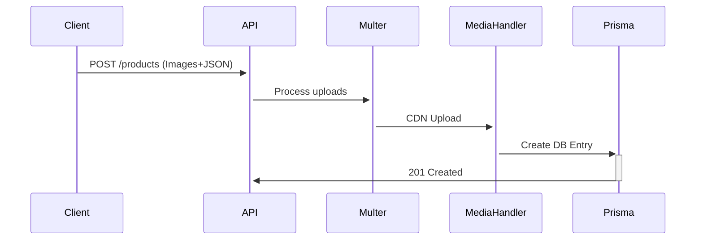
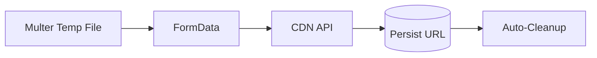
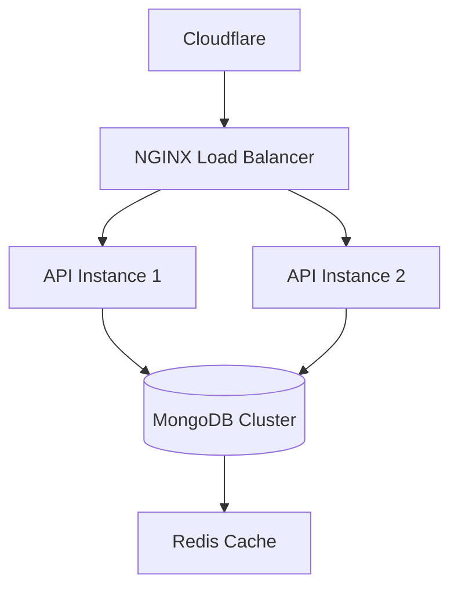

# Meta: Multi-Tenant E-commerce Platform Documentation

**Version 1.0**

---

## Chapter 1: Architecture Overview

### System Components



### Key Features

- **Multi-Tenant Isolation**: Stores operate independently with domain-based routing
- **Modular Design**: Split into auth, content, payments, and product management
- **Hybrid API**: REST for CRUD + GraphQL for complex queries

---

## Chapter 2: Database Models

### Core Schemas

#### 1. Product Model (`Product.js`)

```javascript
{
  storeId: "STR_123", // Partition key
  sku: "PROD-456",
  slug: "wireless-headphones",
  specifications: [
    {key: "Battery", value: "20hrs"},
    {key: "Colors", value: ["Black","Silver"]}
  ]
}
```

#### 2. Category Hierarchy (`Category.js`)



#### 3. Order Relationships



---

## Chapter 3: Middleware Ecosystem

### Processing Pipeline



### Key Middlewares

| Middleware                    | Functionality                       | Error Codes          |
| ----------------------------- | ----------------------------------- | -------------------- |
| `storeIdentifctionMiddleware` | Domain→StoreID mapping              | 400, 404             |
| `authenticate`                | JWT validation + user/store binding | 401                  |
| `authorizeStoreAccess`        | RBAC for store admins               | 403                  |
| `multerConfig`                | File upload handling                | 413 (File too large) |

---

## Chapter 4: Controller Landscape

### Module Matrix

| Controller          | Key Methods                    | Dependencies        |
| ------------------- | ------------------------------ | ------------------- |
| `productController` | createProduct, getCategoryTree | Multer, Slugify     |
| `paymentController` | sendData, CheckData            | PhonePe SDK, Prisma |
| `contactController` | createSubmission, updateStatus | Nodemailer, Prisma  |
| `phonePeController` | toggleStatus, updateConfig     | Crypto, Prisma      |

### Flow: Product Creation



---

## Chapter 5: GraphQL API Deep Dive

### Schema Design Principles

1. **Store-Centric**: All queries implicitly use `storeId`
2. **Nested Resolvers**:

```graphql
query {
  aboutPage {
    companyFact {
      factItems {
        # 3-level nesting
        label
      }
    }
  }
}
```

### Performance Tactics

- **Query Batching**: Single resolver fetches related entities
- **Caching**: Apollo Server caching for common queries
- **Selective Loading**:

```javascript
// Only load media if requested
include: {
  media: context.queryHasField("media");
}
```

---

## Chapter 6: REST API Endpoints

### Security Configuration

```javascript
// Typical protected route
router.post(
  "/products",
  authenticate, // Verify JWT
  authorizeStoreAccess, // Check admin role
  upload.array("images", 5), // Max 5 files
  validateProductData, // Joi validation
  createProduct // Handler
);
```

### Key Endpoints

| Path                       | Methods   | Rate Limit |
| -------------------------- | --------- | ---------- |
| `/api/products`            | GET, POST | 100/min    |
| `/api/payments`            | POST      | 20/min     |
| `/api/contact-submissions` | GET       | 50/min     |

---

## Chapter 7: Utility Modules

### Media Handler Workflow



### Order Item Factory

**Input**

```javascript
{
  productId: "60ab12cd34ef56",
  quantity: 2,
  variant: "Size:L"
}
```

**Output**

```javascript
{
  sku: "PROD-123",
  price: 2999,
  image: "cdn/headphones.jpg",
  specifications: [...]
}
```

---

## Chapter 8: Security Framework

### Defense Layers

1. **Transport**: HTTPS + SSL pinning
2. **Authentication**: JWT with storeID claims
3. **Authorization**: Role-based access control
4. **Validation**: Request schema validation
5. **Sanitization**:

```javascript
// Product title sanitization
title.replace(/<[^>]*>?/gm, "");
```

### Monitoring

- Suspicious activity detection (>5 failed logins/min)
- File upload MIME type validation
- Query complexity analysis (GraphQL)

---

## Chapter 9: Error Handling System

### Standard Response Format

```json
{
  "success": false,
  "code": "PRODUCT_NOT_FOUND",
  "message": "No product with ID 123",
  "details": {
    "storeId": "STR_123",
    "attemptedId": "123"
  }
}
```

### Error Types

| Category       | Example Codes              | HTTP Status |
| -------------- | -------------------------- | ----------- |
| Authentication | INVALID_JWT, EXPIRED_TOKEN | 401         |
| Authorization  | STORE_ACCESS_DENIED        | 403         |
| Validation     | INVALID_PRODUCT_SKU        | 400         |
| Database       | RECORD_NOT_FOUND           | 404         |

---

## Chapter 10: Deployment & Scaling

### Infrastructure Diagram



### Horizontal Scaling Strategies

1. **Stateless APIs**: Auto-scale based on CPU/RAM
2. **DB Sharding**: `storeId` as shard key
3. **CDN**: Offload media to Cloudflare/BunnyCDN

---

This documentation provides a panoramic view of the platform's architecture, from database schemas to API security practices. Each component works in concert through well-defined interfaces and middleware layers, enabling secure multi-tenant operations at scale.
